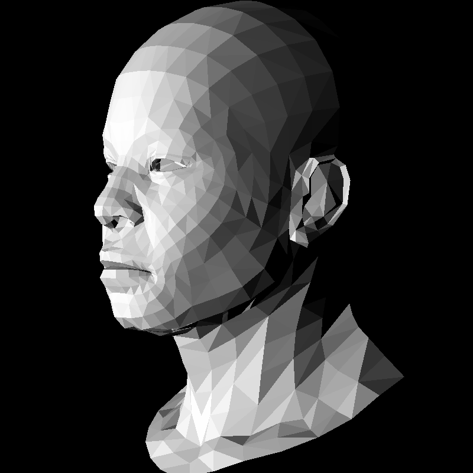

# braster
A learning project for software rendering, reading through ssloy/tinyrenderer, written in C. The goal was to learn about the basics of rendering a 3D object to the screen, focusing on the math involved and the techniques. Primarily used pikuma for the math portions to help build a more solid understanding of the fundementals.



## TODO:
- [ ] Implement texturing
- [ ] Shading
- [ ] Fix issue with certain colour values causing distortions (?)

## Quick building
Within main directory:
```
mingw32-make
```

There's also build tasks for VS Code.

Run 'render.exe' and result will be written to 'frame.ppm'. You can use a 'ppm' viewer from VS Code extensions to the view the image.

